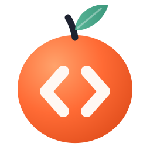

<p align="center"></p>

<h1 align="center">Pluck</h1>

<p align="center"><b>Kodu ekrandan kopar.</b><br>
Ekrandaki herhangi bir kodu seç, saniyeler içinde gerçek, kopyalanabilir metin olarak al.</p>

YouTube videosu, toplantıda paylaşılan ekran, PDF, uzak masaüstü, bir resim içindeki kod… Kopyalanamayan her kodu `Ctrl+Shift+X` ile seç; Pluck kodu tanır, **girintisini geri kurar**, dilini bulur ve panoya koyar.

## Neden sıradan OCR'dan farklı?

Sıradan OCR boşlukları yok sayar; kod için bu ölümcüldür (Python'da girinti = anlam). Pluck, kod ekranlarının neredeyse her zaman **eş aralıklı (monospace) yazı tipiyle** çizildiğini kullanır. Her kelimenin piksel konumunu karakter ızgarasına geri çevirir ve şunları yeniden kurar:

| Sorun | Pluck ne yapar |
|---|---|
| Girintiler kaybolur | Kelime konumlarından sütun hesaplar, girinti birimini (2/3/4) tespit edip hizalar |
| Satır içi hizalama bozulur | Kelimeler arası boşluk sayısını piksel aralığından çıkarır |
| Boş satırlar silinir | Satır aralığından boş satırları geri ekler |
| Alt çizgiler (`__init__`) düşer | Boşluklardaki taban çizgisi piksellerini tarayıp `_` karakterlerini **piksellerden geri okur** |
| OCR sembolleri atlar (tek başına `}`, `===`, `=>`, `COUNT(*)`) ve benzer karakterleri karıştırır (`l`/`1`/`I`, `0`/`O`, `(`/`C`) | Eş aralıklı ızgarayı ve yazı tipini görüntüden kalibre edip atlanan hücreleri glif şablonlarıyla **piksellerden okur**, benzer karakterleri yeniden doğrular |
| Parantezler ve isimler bozulur (`for Cint i`, `[1, 2}`, tek yerde `va1ue`) | Parantezleri eşleştirir, aynı kodda çok geçen isimlerle ve dil anahtar kelimeleriyle tutarsız yazımları düzeltir |
| Editör satır numaraları karışır | Sağa hizalı, ardışık numara sütununu tespit edip siler |
| `$`, `>>>`, `PS C:\>` istemleri | Terminal ve REPL istemlerini temizler, çıktı satırlarını korur |
| Bir satır birkaç parçaya bölünür | Kelimeleri dikey konuma göre yeniden satırlara toplar |
| “Akıllı” tırnaklar, `fi` bitişik harfleri, Consolas'ın çizgili `Ø` sıfırı | ASCII karşılıklarına çevirir |
| Koyu tema, renkli sözdizimi, diff satır renkleri | Mürekkebi her piksel satırının kendi arka plan rengine uzaklığıyla ölçer; renkli parantezler ve soluk yorumlar kaybolmaz. Büyütür, kenar boşluğu ekler |

## Özellikler

Lightshot kadar basit: kısayola bas, seç, `Ctrl+C`.

- **Tek tıkla blok seçimi** - imleci bir kod bloğunun üstüne getir, blok kesikli çerçeveyle belirir; tıkla, seçilsin. Sürüklemene gerek yok
- **Bekleme yok** - fareyi bıraktığın anda tanıma arka planda başlar; `Ctrl+C`'ye bastığında kod çoğu zaman hazırdır. Seçim ekranı ~80 ms'de açılır
- **Seçimin yanında küçük araç çubuğu** - kodu kopyala, düzenle, dosyaya kaydet (dile göre doğru uzantıyla), görüntüyü kopyala. Çubukta tespit edilen dil ve satır sayısı görünür
- **IDE'ye gönder** - kodu dile uygun uzantıyla `Belgeler\Pluck` içine kaydedip doğrudan IDE'de açar (kod panoya da kopyalanır). VS Code, Cursor, Windsurf, tüm JetBrains IDE'leri (PyCharm, IntelliJ, WebStorm, Rider, GoLand, CLion, …), Android Studio, Sublime Text ve Notepad++ otomatik bulunur. **Otomatik** modda dile göre en uygun IDE seçilir: Python için PyCharm, Java için IntelliJ, yoksa VS Code
- **Son alanı tekrar seç** - `Space`. Video izlerken her sahnede aynı alanı yakalamak için
- **Çift tık** - kopyala ve kapat
- **İnce ayar** - ok tuşlarıyla seçimi 1 piksel kaydır, `Shift`+ok ile boyutlandır; köşe ve kenar tutamakları, sürükleyerek taşıma
- **Anında mod** (isteğe bağlı) - seçimi bıraktığın an kopyalar
- **Pano izleme** - `Win+Shift+S` ile alınan her ekran görüntüsü otomatik çözülür
- **İki tanıma motoru** - Windows OCR (gömülü, çevrimdışı) ve isteğe bağlı Claude Vision (API anahtarı tanımlıysa Otomatik mod onu kullanır, hata olursa Windows OCR'a döner)
- **20+ dil tespiti**, sözdizimi renklendirmeli düzenleyici, aranabilir geçmiş, komut satırı
- **Türkçe ve İngilizce arayüz** - Ayarlar → Arayüz dili; Otomatik seçenek Windows'un diline uyar

> Pluck daha önce **CodeLift** (1.5) ve **SnapCode** (1.4 ve öncesi) adını taşıyordu. Yeni sürümü kurmak eskisini günceller; ayarlar, geçmiş ve "Windows ile başlat" kendiliğinden taşınır.

### Seçim ekranı kısayolları

| Tuş | İşlev |
|---|---|
| `Ctrl+C` / `Enter` / çift tık | Kodu kopyala |
| `Ctrl+O` | IDE'de aç |
| `Ctrl+E` | Düzenleyicide aç |
| `Ctrl+S` | Kodu dosyaya kaydet |
| `Ctrl+Shift+C` | Görüntüyü kopyala |
| `Space` | Son seçilen alan |
| `Ctrl+A` | Tüm ekran |
| Ok / `Shift`+Ok | Kaydır / boyutlandır |
| `Esc` / sağ tık | İptal |

## İndir

**[Pluck-Setup.exe - son sürüm](https://github.com/sefermavi4243-droid/snapcode/releases/latest)**

Yönetici izni istemez, yaklaşık 35 MB. Kurulumda "Windows ile başlat" seçilebilir. Güncellemek için yeni sürümü kurman yeterli; ayarlar ve geçmiş korunur. Gereksinim: Windows 10/11 (64 bit).

> İlk sürümler kod imzası taşımadığı için Windows SmartScreen "Tanınmayan uygulama" uyarısı gösterebilir: **Ek bilgi - Yine de çalıştır**.

## Kaynaktan çalıştırma

Gereksinim: Python 3.10+

```powershell
git clone https://github.com/sefermavi4243-droid/snapcode.git
cd snapcode
pip install -e .
pluck
```

Windows OCR için en az bir OCR dil paketi gerekir (İngilizce genelde yüklüdür). Kontrol:
`Get-WindowsCapability -Online | ? Name -like 'Language.OCR*'`.

### Kurulum dosyasını derleme

```powershell
pip install pyinstaller
winget install JRSoftware.InnoSetup
powershell -ExecutionPolicy Bypass -File packaging\build.ps1
```

Çıktı: `build\installer\Pluck-Setup-<sürüm>.exe`. Betik, paketlenmiş `.exe` içinde OCR'ın çalıştığını kendi kendine test eder. `v*` etiketi gönderildiğinde GitHub Actions aynı derlemeyi yapıp kurulum dosyasını Releases'e yükler.

### Claude Vision motoru (isteğe bağlı)

```powershell
setx ANTHROPIC_API_KEY "sk-ant-..."
```

ya da anahtarı tepsi menüsü → **Ayarlar** içinden girin. Anahtar tanımlıysa **Otomatik** motor Claude'u kullanır.

## Kullanım

`Ctrl+Shift+X` (veya tepsi simgesine tıkla) - kod bloğuna tıkla ya da alanı sürükle - `Ctrl+C`.

### Komut satırı

```powershell
pluck ekran.png                      # kodu stdout'a yazar
pluck ekran.png --engine claude      # belirli motor
pluck --clipboard --copy             # panodaki görüntüyü çöz, kodu panoya geri koy
pluck ekran.png --json               # dil, motor, süre ve notlarla JSON
pluck ekran.png --ide                # IDE'de aç (otomatik seçim)
pluck ekran.png --ide pycharm        # belirli IDE'de aç
```

## Mimari

```
pluck/
├── app.py              tepsi uygulaması, erken tanıma, pano izleme
├── hotkey.py           Win32 global kısayol dinleyicisi
├── pipeline.py         görüntü → kod (Qt'den bağımsız; CLI ve testler kullanır)
├── postprocess.py      geometri tabanlı kod yeniden kurma
├── languages.py        ağırlıklı imza + Pygments ile dil tespiti
├── history.py          SQLite geçmiş
├── ide.py              kurulu IDE'leri bulma ve kodu IDE'de açma
├── engines/
│   ├── windows_ocr.py  Windows.Media.Ocr + piksel sondası
│   └── claude_vision.py
└── ui/                 seçim ekranı, düzenleyici, geçmiş, ayarlar, tema
```

## Testler

```powershell
pip install pytest
pytest
```

`tests/test_windows_ocr.py`, Consolas ile kod çizip gerçek Windows OCR motorundan birebir aynı kodun (girinti, satır numarası temizliği, koyu tema dahil) geri geldiğini doğrular.

## Lisans

MIT
