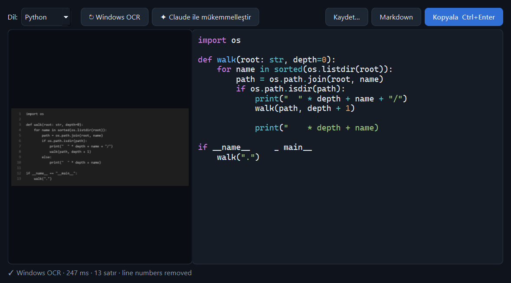

# SnapCode

**Ekrandaki herhangi bir kodu yakala, saniyeler içinde gerçek, kopyalanabilir metin olarak al.**

YouTube videosu, toplantıda paylaşılan ekran, PDF, uzak masaüstü, bir resim içindeki kod… Kopyalanamayan her kodu `Ctrl+Shift+X` ile seç; SnapCode kodu tanır, **girintisini geri kurar**, dilini bulur ve panoya koyar.



## Neden sıradan OCR'dan farklı?

Sıradan OCR boşlukları yok sayar; kod için bu ölümcüldür (Python'da girinti = anlam). SnapCode, kod ekranlarının neredeyse her zaman **eş aralıklı (monospace) yazı tipiyle** çizildiğini kullanır. Her kelimenin piksel konumunu karakter ızgarasına geri çevirir ve şunları yeniden kurar:

| Sorun | SnapCode ne yapar |
|---|---|
| Girintiler kaybolur | Kelime konumlarından sütun hesaplar, girinti birimini (2/3/4) tespit edip hizalar |
| Satır içi hizalama bozulur | Kelimeler arası boşluk sayısını piksel aralığından çıkarır |
| Boş satırlar silinir | Satır aralığından boş satırları geri ekler |
| Alt çizgiler (`__init__`) düşer | Boşluklardaki taban çizgisi piksellerini tarayıp `_` karakterlerini **piksellerden geri okur** |
| Editör satır numaraları karışır | Sağa hizalı, ardışık numara sütununu tespit edip siler |
| `$`, `>>>`, `PS C:\>` istemleri | Terminal ve REPL istemlerini temizler, çıktı satırlarını korur |
| Bir satır birkaç parçaya bölünür | Kelimeleri dikey konuma göre yeniden satırlara toplar |
| “Akıllı” tırnaklar, `fi` bitişik harfleri, Consolas'ın çizgili `Ø` sıfırı | ASCII karşılıklarına çevirir |
| Koyu tema | Görüntüyü otomatik ters çevirip büyütür, kenar boşluğu ekler |

## Özellikler

- **Global kısayol** (`Ctrl+Shift+X`, değiştirilebilir) - Win32 `RegisterHotKey`, ek bağımlılık yok
- **Çoklu monitör ve HiDPI** destekli, ekranı donduran seçim katmanı; **piksel büyüteci**, renk kodu ve seçim boyutu
- **İki tanıma motoru**
  - **Windows OCR** - Windows 10/11'e gömülü, tamamen çevrimdışı, ~200 ms
  - **Claude Vision** - kodu bir geliştirici gibi okur: birebir girinti, `l`/`1`/`I` ve `O`/`0` ayrımı, editör arayüzünü yok sayma. Otomatik modda Claude başarısız olursa Windows OCR'a düşer
- **Pano izleme** - `Win+Shift+S` ile alınan her ekran görüntüsü otomatik çözülür (tam olarak "ekran görüntüsü aldım, kodu kopyaladım" akışı)
- **20+ dil tespiti** (Python, JS/TS, Java, C#, C/C++, Go, Rust, SQL, Bash, PowerShell, …) ve sözdizimi renklendirme
- **Sonuç penceresi** - görüntü ve kod yan yana, düzenlenebilir; tek tıkla motor değiştirip yeniden tanıma
- **Kopyala / Markdown bloğu olarak kopyala / doğru uzantıyla kaydet**
- **Aranabilir geçmiş** (SQLite) - küçük resimleriyle birlikte, düzenlemeler otomatik kaydedilir
- **Komut satırı** - betiklerde ve otomasyonda kullanmak için

## Kurulum

Gereksinim: Windows 10/11, Python 3.10+

```powershell
git clone https://github.com/sefermavi4243-droid/snapcode.git
cd snapcode
pip install -e .
```

Windows OCR için en az bir OCR dil paketi gerekir (İngilizce genelde yüklüdür). Kontrol:
`Ayarlar → Saat ve dil → Dil` ya da PowerShell'de `Get-WindowsCapability -Online | ? Name -like 'Language.OCR*'`.

### Claude Vision motoru (isteğe bağlı)

```powershell
setx ANTHROPIC_API_KEY "sk-ant-..."
```

ya da anahtarı tepsi menüsü → **Ayarlar** içinden girin. Anahtar tanımlıysa **Otomatik** motor Claude'u kullanır.

## Kullanım

```powershell
snapcode            # sistem tepsisinde başlar (ya da: pythonw -m snapcode)
```

1. `Ctrl+Shift+X` tuşlarına bas (veya tepsi simgesine tıkla)
2. Kodun etrafını sürükleyerek seç (`Enter` = tüm ekran, `Esc` = iptal)
3. Kod panoda. Sonuç penceresinde düzenle, `Ctrl+Enter` ile kopyala ve kapat

| Kısayol (sonuç penceresi) | İşlev |
|---|---|
| `Ctrl+Enter` | Kopyala ve kapat |
| `Ctrl+S` | Dosyaya kaydet |
| `Esc` | Kapat |

### Komut satırı

```powershell
snapcode ekran.png                      # kodu stdout'a yazar
snapcode ekran.png --engine claude      # belirli motor
snapcode --clipboard --copy             # panodaki görüntüyü çöz, kodu panoya geri koy
snapcode ekran.png --json               # dil, motor, süre ve notlarla JSON
```

## Mimari

```
snapcode/
├── app.py              tepsi uygulaması, iş parçacığı havuzu, pano izleme
├── hotkey.py           Win32 global kısayol dinleyicisi
├── pipeline.py         görüntü → kod (Qt'den bağımsız; CLI ve testler kullanır)
├── postprocess.py      geometri tabanlı kod yeniden kurma
├── languages.py        ağırlıklı imza + Pygments ile dil tespiti
├── history.py          SQLite geçmiş
├── engines/
│   ├── windows_ocr.py  Windows.Media.Ocr + piksel sondası
│   └── claude_vision.py
└── ui/                 seçim katmanı, sonuç/geçmiş/ayar pencereleri, tema
```

## Testler

```powershell
pip install pytest
pytest
```

`tests/test_windows_ocr.py`, Consolas ile kod çizip gerçek Windows OCR motorundan birebir aynı kodun (girinti, satır numarası temizliği, koyu tema dahil) geri geldiğini doğrular.

## Lisans

MIT
